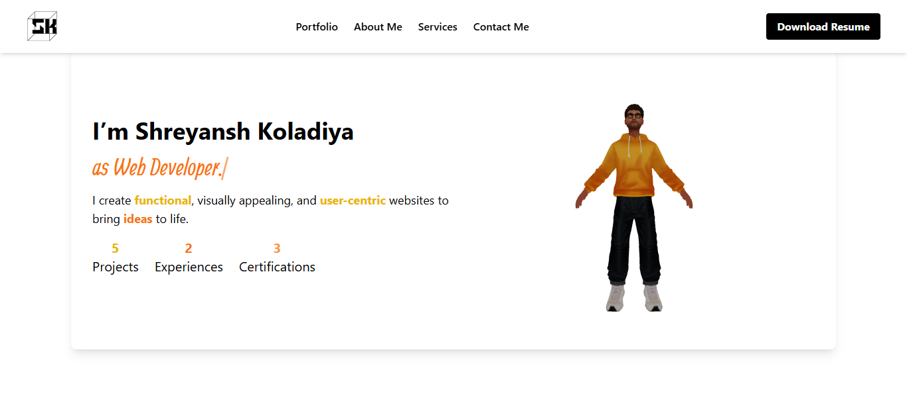

# 🚀 Om Portfolio

Welcome to my portfolio! This website showcases my work, skills, and projects as a **Web Developer/UX-UI Designer**.

## 🌐 Live Demo

<!-- Add your live demo link here -->

## 📸 Screenshots



## ✨ Features

- 💻 Showcases my projects and skills
- 📱 Fully responsive design
- 🎨 Built with modern UI/UX practices
- 🌟 3D animations using Three.js

## 🛠 Tech Stack

- **Frontend:** React, Tailwind CSS, Three.js
- **Deployment:** Vercel / Netlify

## 📥 Installation & Setup

If you want to run this project locally, follow these steps:

```bash
# Clone the repository
git clone https://github.com/YOUR_USERNAME/YOUR_REPO_NAME.git

# Navigate to the project folder
cd OmPortfolio

# Install dependencies
npm install

# Start the development server
npm run dev
```

## 📧 Contact

Feel free to reach out!

- 📧 Email: [your.email@example.com](mailto:your.email@example.com)
- 🔗 LinkedIn: [your-linkedin-profile](https://www.linkedin.com/)

---

### Made with ❤️ and a lot of debugging by **Om Portfolio**
